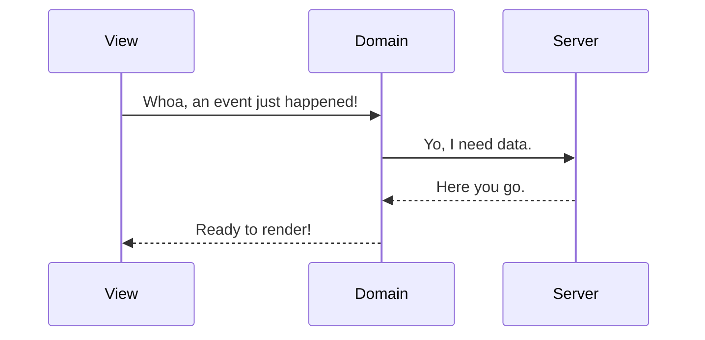
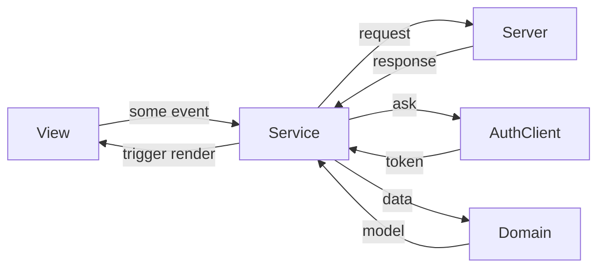

---
{"dg-publish":true,"permalink":"/typesafe-domain-services-in-react-with-fp-ts-and-reader-task-either/","dgHomeLink":true,"dgPassFrontmatter":false}
---


# Typesafe Domain Services in React with fp-ts and ReaderTaskEither

Let's build a service. What is a Service, you ask? I cover this in [[What is a Service?|What is a Service?]].

One of the things we do often and repeatedly in a single-page client application is fetch data from an HTTP endpoint. This data more-often-than-not corresponds to the concepts inside our domain. In our domain, we love working with pure data. However, the process for fetching it is often anything but pure.

In a nice, pure FP world, we would expect something like this.


However, in practice, this becomes a lot more complex. Requests to the server can fail. We may need to access outside state. We may get errors deserializing results. All of these concerns fall well outside of the responsibility of our domain.

In fact, our domain should not even be talking to the HTTP client at all. That falls well outside of its responsibility. As does authentication, error handling and deserializing. We need to rely on a third party to broker communication between the mechanism that delivers and our domain, which shapes it. That third party is our service.



I think most of the time when we picture a broker like this, we picture an object, something that's stateful. After all, it needs to interact with the messy outside world.

But what if we could do it all in a single function? By which I mean, a single _composed_ function. A function that is made up of several tinier functions. But it's pure and stateless.

Let's dig in. What do we need this service to do?

- Request data over HTTP
- Handle errors
- Construct our view model from returned data
- Validate data received is what we expect
- Support multiple environments (host names) for endpoints
- Support fetching an authentication token
- Add error and debug logging

## Fetching Data with Task

Okay, let's start with the simplest version. Let's issue a GET request to an endpoint.

```ts
const httpGet = (url: string): Promise<AxiosResponse> => axios.get(url)
```

So we have a function of `string -> Promise`. Cool. But there's a small issue with using `Promise` as the return type. A `Promise` always beings execution as soon as it is created. But as a functional programmer, I often want to exert a little more control over when execution happens (read: laziness). In fact, I might want to apply the URL to this function well before I intend to execute it. So let's make one small change:

```ts
const httpGet = (url: string) => (): Promise<AxiosResponse> => axios.get(url)
```

So now when I invoke `httpGet('http://example.com')`, instread of getting an in-progress `Promise`, I instead get a parameterless function than I invoke _somewhere else_ when I intend to kick off my request.

```ts
const getExample = httpGet('http://example.com');

const runProgram = async () => {
  const response = await getExample();
  console.log(response.status)
}
```

This is often called a _thunk_ (as in, the thinking it already done, this function has 'thunk'). In the world of `fp-ts`, a _thunk_ around an asynchronous execution can also be called a [Task](https://gcanti.github.io/fp-ts/modules/Task.ts.html) and typed accordingly.

```ts
import { Task } from 'fp-ts/Task'

const httpGet = (url: string): Task<AxiosResponse> => () => axios.get(url)
```

Typing this as a task opens up some options for us. Task is a [type class](https://gcanti.github.io/fp-ts/#type-classes) in `fp-ts` which means it can conform to a number of interfaces.

If want to access the value of the underlying promise of the Task, we can use `Task.map`:

```ts
import { pipe } from 'fp-ts/function'
import * as T from 'fp-ts/task'

const getPerson = (id: string) => pipe(
  httpGet(`http://example.com/person/${id}`)
  T.map((response) => new Person(response.data))
)

await getPerson(123) // Person { ... }
```

And if we want to execute one Task and feed its result into another task, we can do that with  `Task.chain`:

```ts
import { pipe } from 'fp-ts/function'
import * as T from 'fp-ts/task'

const getPerson = pipe(
  httpGet('http://example.com/person/1')
  T.map((response) => new Person(response.data))
)

const getRecord = (person: Person) => pipe(
  httpGet(`http://example.com/records/`${person.recordId}),
  T.map((response) => new Record(response.data))
)

const getRecordForPerson = (id: string) => pipe(
  getPerson(id),
  T.chain(person => getRecord(person))
)

await getRecordForPerson(123) // Record { ... }
```

See what we've done here? We've created two wholly separate and _pure_ service functions, and composed them together to create a third service function. This whole idea of taking very simple functions and bringing them together as building blocks for a more complex pipeline of operation is how we're going to build our http service layer.

> [!INFO]
 Take notice of the `map` and `chain` functions. This post doesn't really cover the [what or why of type classes](https://dev.to/gcanti/getting-started-with-fp-ts-setoid-39f3), but those functions are part of the common interface between many of the types we encounter in `fp-ts` and we will see them quite a bit in our travels.

## Handling Failure with TaskEither

Okay, it's time to fess up. I've been lying to you (slightly). In the previous section, I mentioned that you can fetch data over HTTP by ecapsulating a Promise inside of a Task. That's not _entirely accurate_. Sure, it _might_ work. But did you notice something about our implementation? We never handled a failure case. Because Task _can't deal with rejection_.

So let's back up a bit and talk about Task a little more before we move on. In the previous section you might have gotten the impression that Tasks are analgous to Promises. That's not really true. You may have thought that a task is just an alternative to handling asynchronous code.  And that is only a half truth.

If we look at definition of Task in the [ `fp-ts`](https://gcanti.github.io/fp-ts/modules/Task.ts.html) docs, it states the following:

> `Task<A>` represents an asynchronous computation that yields a value of type `A` and **never fails**. If you want to represent an asynchronous computation that may fail, please see `TaskEither`.

Oh. Tasks should _never fail_. So we should ask ourselves: do HTTP requests fail? Of course they do. **All the damn time**. So it's disigenuous to try to represent an HTTP request as a task. The docs advise using something called `TaskEither`.

`TaskEither` is pretty much exactly what it says on the tin. It is a Task that yields _either_ a success value or a failure value. Whereas a `Task<A>` only allows us to wrap a type that represent success, `TaskEither<E, A>` allows us to represent both success and failure.

So we've already explained the ideas behind `Task`. Now, let's talk a bit about `Either`.

> [!INFO]
> Let me be clear. A `Task` is its own type with an interface. An `Either` is also it's own standalone type with an interface. A `TaskEither` is also it's own type and it's own interface. However, a `TaskEither` can be regarded like a `Task` and an `Either` that have been smooshed together.

So an `Either` is a type that represents the sum of success and failure. While we're working with an `Either`, we can address the success case and the failure case simultaneously, before we ever need to know the actual result. It's another situation where we can declare our intention around an operation prior to running it.

The type parameters for an Either look like `Either<E,A>`. We consider `E` to be the failure value and `A` to be the success value. We will also refer to `E` as the *left* value and `A` as the *right* value.

Left and right can be Either constructors as well. If we have a value that already represents success or failure, we can contruct the either accordingly.

```ts
import * as E from 'fp-ts/Either'
import { Either } from 'fp-ts/Either'

const aFoo: Either<Error, string> = E.right("foo");
const notAFoo: Either<Error, string> = E.left(new Error("error"));
```

Of course, we're probably more interested in creating an either when evaluating a given expression:

```ts
const makeFoo: Either<Error, "foo"> = E.fromPredicate(
  (val: string) => val === "foo", // a predicate to validate success
  () => new Error("must be foo") // the failure value
)

// Note: Right and Left are type constructor for Either
makeFoo("foo") // => Right("foo")
makeFoo("bar") // => Left(Error("must be foo"))
```

Once we've constructed an Either, we can then pass it around as a value, and lazily declare operations on it's underlying values:

```ts

// In the case of Either, `map`, will always operate on the right (success) value.`mapLeft` acts like `map`, but over left (failure) value.
const makeFOO = flow(
  makeFoo,
  E.map(foo => foo.toUppercase()),
  E.mapLeft(err => ({ message: `An error ocurred: ${err}`}))
)

// Either is also a Bifunctor, so we can also just use `bimap` which takes two functions for left and right values
const makeFOO = flow(
  makeFoo,
  E.bimap(  
    err => ({ message: `An error occurred: ${err}`}),  
    foo => foo.toUpperCase()  
  )
)
```

Up until this point, it did not matter what the actual underlying value of our Either was. We could pretend it was successful, or we could pretend it errored. Our program did not care as long as we were engaged with the `Either` type. Eventually, of course, we will need to get at that value. To do that, we need to deconstruct, or unwrap, the Either.

We can use `Either.match` (also known as `Either.fold`) to apply a function to the underlying values.

```tsx

const currentStatus = flow(
  makeFOO,
  E.match(
    err => err.message,
    identity
  )
)

const fooStatus = currentStatus("foo") // => "FOO"
const barStatus = currentStatus("bar") // => "An error occurred: must be foo"


```

If we don't care about the specifics of the failure case, we can also just get the success value, or fallback to a default value.
 
```ts
const currentStatus = flow(
  makeFOO,
  E.getOrElse(() => "error")
)

currentStatus("foo") // => "FOO"
currentStatus("bar") // => "error"
```

> [!INFO]
> We've been using a contrived example here to demonstrate `Either`. I don't want to give you the false impression that `Either` is a good type for representing values that are _optional_. `Either` is designed to encapsulate operations that would normally have failure state whose details we are interested in. If you find that you either don't care about your failure state, or always fallback to an empty or default value you should probably be [using the `Option` type instead](https://gcanti.github.io/fp-ts/modules/Option.ts.html)

## Onto TaskEither

So the big takeaway around using `Either` is that it allows us to pass around a value that can represent the output of an operation without having to decide what to do with the value of that output the second that operation occurs. Compared to a Promise, an Either doesn't  force us down an exception-handling path, either. We still only have a single function pipeline.

So if a Task provides us with the asynchronicity of a Promise, and the Either allows us to elegantly handle errors, what we really want is a combination of the two. A TaskEither, if you will.

Well, `fp-ts` has us covered in that regard. And building one out of a Promise thunk is _almost_ as simple as building our task.

```ts
import * as TE from 'fp-ts/TaskEither'

export const httpGet = (url: string) => {
  return TE.tryCatch<Error, AxiosResponse>(
    () => axios.get(url),
    (reason: unknown) => {
      return new Error(`${reason}`)
    }
  )
}

```

We are using `TE.tryCatch` to handle any potential exceptions from the Promise, giving us our `Either`. 

And that's it, really. Once you understand `Task` and `Either`, using `TaskEither` becomes pretty straightforward. You've got a similar set of functions. You can `map`, `mapLeft`, `match`, `chain`, etc.

```tsx
import * as TE from 'fp-ts/TaskEither'

const getPerson = pipe(
  httpGet('http://example.com/person/1'),
  TE.map((response) => new Person(response.data)),
  TE.getOrElse(EMPTY_PERSON),
)

const PersonComponent = () => {
  const [person, setPerson] = useState(null)
  useEffect(() => {
    const person = await getPerson(1)
    setPersion(person)
  }, [])

  return (
	<p>Hello, {person.name}</p>
  )
}
```

## Sprinkle in some domain with Decoder

Okay, so let's check in on our progress:

- ~~Request data over HTTP~~
- ~~Handle errors~~
- Construct our view model from returned data
- Validate data received is what we expect
- Support multiple environments (host names) for endpoints
- Support fetching an authentication token
- Add error and debug logging

So now we want to actually connect our HTTP fetching to our domain. We should be able to verify that we've received a correct data 'shape' from the server -- ideally something that matches a domain object.

To do this, we'll lean on another library in the `fp-ts` family of modules: [`io-ts`](https://github.com/gcanti/io-ts), which allows us to perform runtime type checking on objects.

> [!INFO]
> I don't talk much about a 'domain layer' in this post, but it's assumed there exists a collection defined object types (entities, value types, etc) and functions for working with them that correspond to the business domain of your app. `io-ts` is a helpful library, but it not the domain itself. We're using it here to validate the raw data received from network requets. Shaping and aggregating that data correctly the responsibility of the domain.
